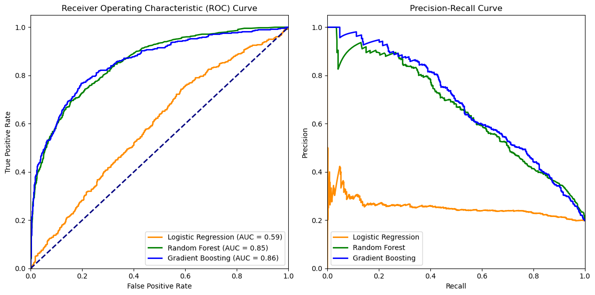
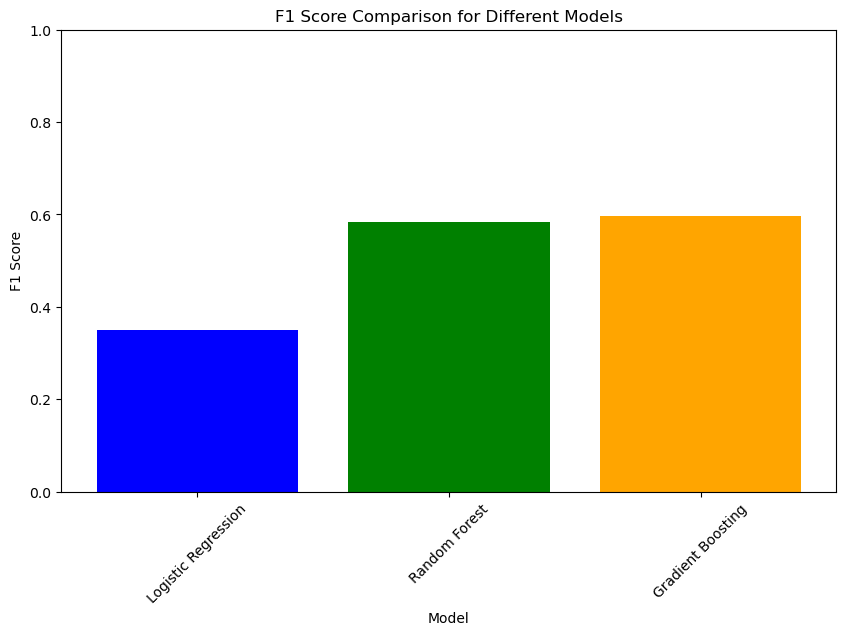

# Supervised-Learning-Churn-Prediction
Customer Churn Prediction for Enhanced Retention at BetaBank

## Project Description
Beta Bank has noticed a gradual attrition of its customer base, prompting them to address this challenge head-on. The bank believes that retaining existing customers is more cost-effective than acquiring new ones. To counteract this churn, the bank aims to predict which customers are likely to leave soon and take proactive measures to retain them. 

The primary objective of this project is to develop a predictive model that can accurately identify customers at risk of churning from Beta Bank. The model's performance will be evaluated using the F1 score, with a minimum target score of 0.59, ensuring a balance between precision and recall.

The process includes data preparation, features selection, model selection and training, then with undergo a model evalutaion to assess effectiveness using the F1 score. After this a AUC-ROC comparision to 
measure the model's ability to determine between churn and non-churn cases.  

### Evalution
F1 Score on Validation Set: 0.6231454005934718

F1 Score on Test Set: 0.6122448979591836

Classification Report on Test Set:
               precision    recall  f1-score   support

           0       0.90      0.94      0.92      1468
           1       0.68      0.56      0.61       351

    accuracy                           0.86      1819
   macro avg       0.79      0.75      0.76      1819
weighted avg       0.86      0.86      0.86      1819

## Conclusion
We started by examining the class imbalance in the dataset and observed that the number of customers leaving the bank and churning their accounts. To address this issue, we employed both upsampling and downsampling techniques. This allowed to create balanced datasets for training and testing the models.

After preparing the data, we trained several classification models, including Logistic Regression, Random Forest, and Gradient Boosting, with the aim of maximizing the F1 score. Additionally, we made use of hyperparameter tuning to optimize the performance of these models. Throughout the process, we evaluated the models using both upsampled and downsampled data on a validation set to ensure robust performance.

Upon evaluating the models, we found that the Random Forest and Gradient Boosting classifiers performed well, with F1 scores close to the desired threshold. While Logistic Regression had a lower F1 score, it still contributed to the model comparison process.  The AUC-ROC and Precision-Recall curves provide a view of the models' performance.

This project highlights the significance of addressing class imbalance, selecting appropriate models, and fine-tuning hyperparameters to achieve a churn prediction solution. Further improvements could involve feature engineering, changing hyperparameters, and potentially collecting additional data. By successfully predicting customer churn, Beta Bank can implement targeted strategies to keep valuable customers and optimize its business operations.
